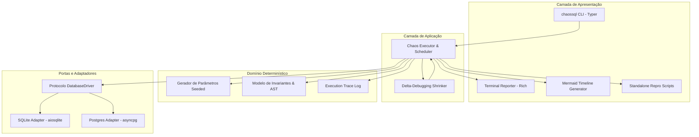
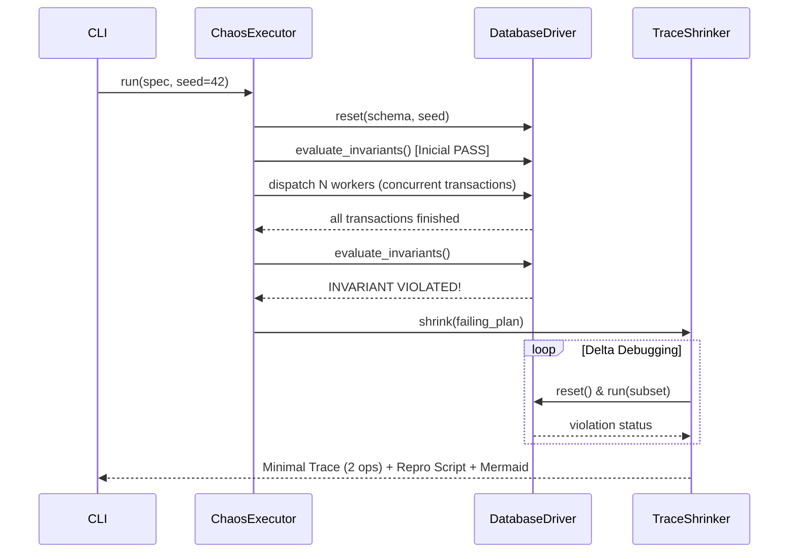

# ARCHITECTURE.md — ChaosSQL System Architecture

Este documento define a arquitetura, os limites entre camadas e as garantias de estado do **ChaosSQL**.

---

## 1. Diagrama geral de Camadas

---

## 2. Garantias de Engenharia

| Garantia | Como é Assegurada |
| :--- | :--- |
| **Determinismo** | Gerador PRNG isolado por `seed` e filas de workers determinísticas |
| **Reprodutibilidade** | O banco é resetado atomicamente (schema + seed) antes de cada execução |
| **Minimalidade** | Algoritmo $ddmin$ (Delta-Debugging) garante que nenhuma operação possa ser removida sem sumir o bug |
| **Segurança de Asserções** | Avaliação de expressões SQL com safe eval isolado (sem acesso a builtins perigosos) |
| **Concorrência Real** | Transações executadas em conexões assíncronas independentes com jitter de latência |

---

## 3. Ciclo de Vida da Execução

