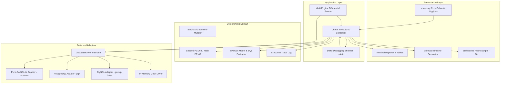
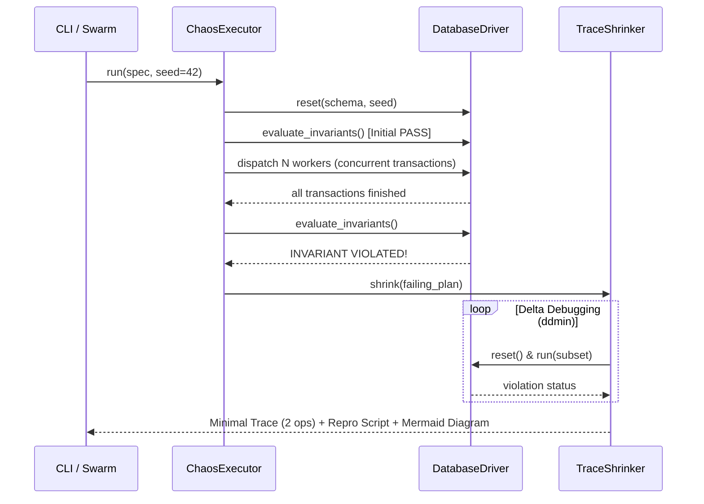

# ARCHITECTURE.md — ChaosSQL System Architecture

This document formalizes the architecture, layer boundaries, and state guarantees of **ChaosSQL**.

---

## 1. General Layer Diagram

---

## 2. Engineering Guarantees

| Guarantee | Enforcement Mechanism |
| :--- | :--- |
| **Strict Determinism** | Isolated PRNG seeded via `--seed`; schedule interleavings reproducible bit-for-bit |
| **Reproducibility** | Atomic database reset (schema DDL + seed DML) executed before every scenario iteration |
| **Minimality** | Causal delta-debugging ($ddmin$) guarantees a 1-minimal trace where no operation can be removed |
| **Assertion Safety** | Isolated SQL evaluator verifying mathematical and business invariants after concurrency runs |
| **Real Concurrency** | Transactions dispatched across asynchronous worker goroutines with stochastic jitter perturbation |
| **Zero CGO** | Static binary compilation (`CGO_ENABLED=0`) across native CLI and WebAssembly targets |

---

## 3. Execution Lifecycle

