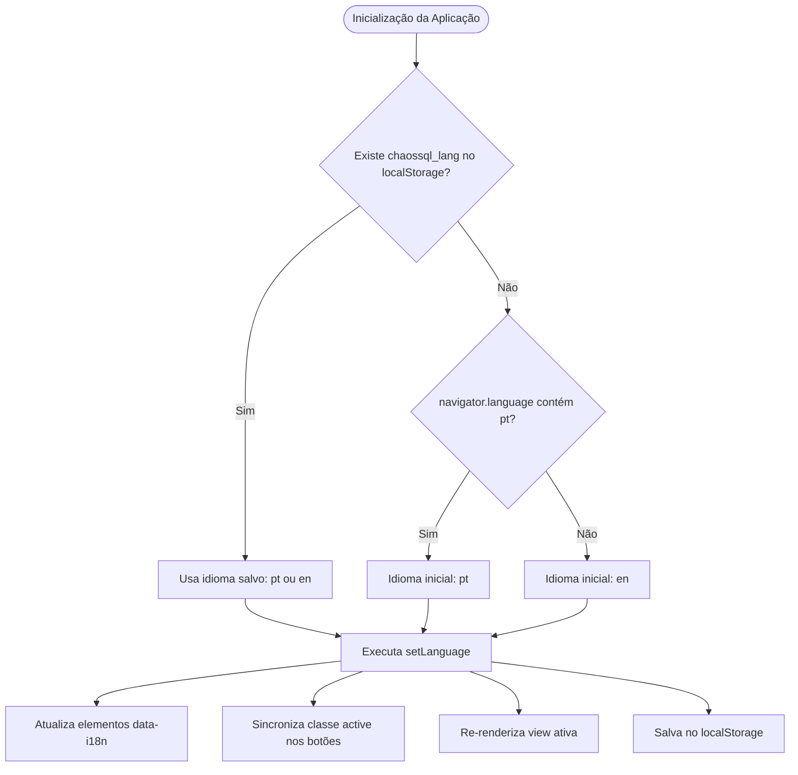

# ChaosSQL Portal Web — Design de Internacionalização Bilíngue (PT-BR / EN)

- **Data**: 2026-09-05
- **Status**: Aprovado pelo Usuário
- **Autor**: Antigravity & Engenharia Studio Bregalda
- **Contexto**: Portal Web e Hub de Documentação Técnica do ChaosSQL v1.2.0

---

## 1. Contexto e Motivação

O portal do ChaosSQL atualmente possui um mix de idiomas entre suas páginas:
- Landing Page com títulos em inglês e explicações em português.
- Centro de Documentação Técnica (`docs-data.js`) com 8 capítulos redigidos em português técnico.
- Catálogo de Cenários (`app.js`) com nomes em inglês, diagnósticos em português e mitigações em português.
- Controles de UI (Terminal interativo, Trace Visualizer e Matriz de Isolamento) com labels bilíngues mesclados.

Para elevar a consistência técnica, atender tanto desenvolvedores de língua portuguesa quanto a comunidade open-source global e pesquisadores de sistemas de banco de dados, implementaremos um sistema de internacionalização (i18n) completo, permitindo alternar 100% do portal entre **Português (PT-BR)** e **Inglês (EN)** com um único clique.

---

## 2. Objetivos e Não-Objetivos

### Objetivos
- **Alternância Instantânea (Zero Reload)**: A troca de idioma ocorre no cliente em tempo real via Vanilla JavaScript, sem recarregar a página e preservando o estado atual (capítulo aberto, aba selecionada, filtros de workers).
- **Cobertura 100% Bilíngue**:
  - Landing page (Hero, simulador de terminal, grafo DSG Adya, 6 cards de engenharia, métricas).
  - Hub de Documentação Técnica (8 capítulos completos, categorias, barra de busca, breadcrumbs).
  - Catálogo de Cenários (10 cenários com descrições, análise de anomalias e a 4ª aba de Fix & Mitigação).
  - Trace Visualizer (timeline Gantt, swimlanes, controles de simulação, inspetor de queries).
  - Matriz de Isolamento Hermitage (tabela, colunas, níveis ANSI e legendas).
- **Design System Studio Bregalda**: Componente *Segmented Pill Switch* `[ PT | EN ]` na navbar desktop e no menu mobile, perfeitamente integrado à paleta de cores (Cream, Ink, Yellow, Elevated).
- **Detecção Automática e Persistência**: Detecção inteligente via `navigator.language` na primeira visita, com persistência da preferência do usuário em `localStorage` (`chaossql_lang`).
- **Zero Dependências**: Continua 100% Vanilla JS, CSS e HTML, garantindo carregamento ultrarrápido (<60KB compactado) e compatibilidade total com o Cloudflare Pages.

### Não-Objetivos
- Não traduzir códigos-fonte de banco de dados (palavras-chave SQL como `SELECT`, `UPDATE`, `BEGIN`, `COMMIT` e comandos Go/YAML permanecem canônicos).
- Não alterar as rotas hash principais (`#/docs`, `#/scenarios`, `#/visualizer`) para evitar quebra de links externos.

---

## 3. Arquitetura do Sistema de i18n

### 3.1 Componente Visual do Switcher (Navbar & Mobile)
- **Estrutura HTML**:
  ```html
  <div class="lang-switch" role="group" aria-label="Language selector">
    <button class="lang-btn active" data-lang="pt" type="button" aria-pressed="true">PT</button>
    <button class="lang-btn" data-lang="en" type="button" aria-pressed="false">EN</button>
  </div>
  ```
- **Comportamento**:
  - Clique no botão do idioma inativo aciona `setLanguage('en')` ou `setLanguage('pt')`.
  - Transição visual suave com destaque no botão ativo (`background: var(--color-yellow)`, `color: var(--color-ink)`).

### 3.2 Gerenciamento de Estado e Ciclo de Vida


### 3.3 Estrutura de Dados da Documentação (`site/docs-data.js`)
O arquivo será estruturado em duas chaves de primeiro nível:
```javascript
window.DOCS_DATA = {
  pt: {
    'getting-started': { title: "...", category: "Começando", summary: "...", content: "..." },
    'dsl-spec': { ... },
    'cli-reference': { ... },
    'trace-visualizer': { ... },
    'cicd-sarif': { ... },
    'drivers': { ... },
    'go-sdk': { ... },
    'academic-theory': { ... }
  },
  en: {
    'getting-started': { title: "Quickstart Guide & Architecture", category: "Getting Started", summary: "...", content: "..." },
    'dsl-spec': { title: "Declarative Language Specification", category: "Specification", summary: "...", content: "..." },
    'cli-reference': { title: "CLI Reference & Subcommands", category: "Interface", summary: "...", content: "..." },
    'trace-visualizer': { title: "Interactive Trace Visualizer", category: "Visualization", summary: "...", content: "..." },
    'cicd-sarif': { title: "CI/CD, SARIF 2.1.0 & GitHub Actions", category: "CI/CD & Security", summary: "...", content: "..." },
    'drivers': { title: "Supported Database Engines & Drivers", category: "Engines", summary: "...", content: "..." },
    'go-sdk': { title: "Go Developer Testing SDK", category: "SDK", summary: "...", content: "..." },
    'academic-theory': { title: "Formal Theory & Mathematical Foundation", category: "Theory", summary: "...", content: "..." }
  }
};
```

### 3.4 Dicionário de UI e Cenários (`site/app.js`)
1. **Dicionário Global `I18N`**:
   - `pt` e `en` contendo traduções para Navbar, Landing Page (títulos, cards de engenharia, terminal), Docs (placeholders, paginação), Visualizer (controles de simulação, inspector) e Matriz (legendas, títulos).
2. **Objeto `SCENARIOS`**:
   - Campos `name`, `description`, `analysis` e `fix` passam a ser objetos `{ pt: "...", en: "..." }`.
   - O campo `fix` conterá `title`, `explanation`, `code` (comentários no idioma correto) e `driverNotes`.

---

## 4. Estratégia de Re-renderização Dinâmica

Ao invocar `setLanguage(lang)`:
1. `document.documentElement.lang = lang`.
2. Todos os elementos com `data-i18n="key"` têm seu conteúdo atualizado com base no caminho da chave (ex: `I18N[lang].landing.heroTitle`).
3. Se o elemento possuir `data-i18n-attr="placeholder:key"`, traduz o atributo correspondente.
4. Os botões `.lang-btn` atualizam `active` e `aria-pressed`.
5. Com base na rota ativa:
   - **`#/docs`**: `renderDocsSidebar()` é chamado para reconstruir categorias e títulos no idioma selecionado, e `renderDocChapter(currentChapter)` atualiza o painel de leitura mantendo o scroll.
   - **`#/scenarios`**: `renderScenarioList()` e `renderScenarioDetail(activeScenarioIndex)` atualizam os nomes, análises e a aba de fix ativa no novo idioma.
   - **`#/visualizer`**: `updateVisualizerTexts()` atualiza os textos da timeline, controles e inspetor sem reiniciar a simulação do trace.
   - **`#/matrix`**: Atualiza a tabela e notas conceituais.

---

## 5. Plano de Verificação e Qualidade

1. **Validação de Sintaxe**: `node -c site/docs-data.js` e `node -c site/app.js`.
2. **Teste de Persistência**: Alternar idioma para `en`, recarregar a página e confirmar que permanece em `en`. Limpar `localStorage` e verificar detecção por `navigator.language`.
3. **Teste de Deep-Linking**: Navegar diretamente para `#/docs/dsl-spec` em inglês e alternar para português; verificar se o capítulo se mantém em `dsl-spec`.
4. **Inspeção de Elementos**: Garantir que nenhum elemento possua texto em português quando no modo inglês e vice-versa (eliminar o estado "meio a meio").
5. **Teste de Servidor HTTP**: Rodar `make serve-site` e testar no navegador.
