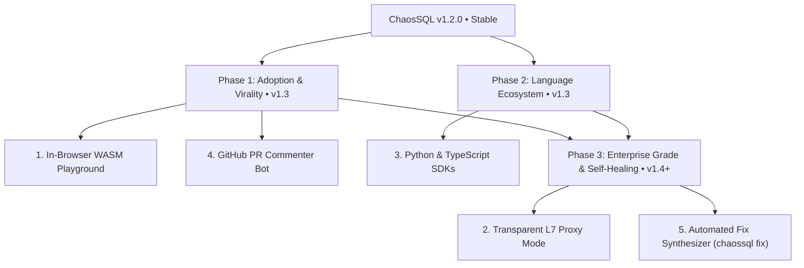

# ChaosSQL — Technical Roadmap & Engineering Specifications (Confidential)

> **CONFIDENTIALITY NOTICE**: This directory (`internal_docs/`) documents private roadmap milestones, intellectual property, and architectural designs for future releases of **ChaosSQL**. Maintain these architectural specifications with care according to team repository governance guidelines.

---

## 📑 Technical Specification Index

| Module / Specification | File | Primary Focus | Target Version |
| :--- | :--- | :--- | :---: |
| **1. WebAssembly In-Browser Playground** | [`01_wasm_in_browser_playground.md`](01_wasm_in_browser_playground.md) | `GOOS=js GOARCH=wasm` compilation, fuzzer execution, and virtual SQLite 100% in-browser without backend servers, streaming via Web Workers. | **v1.3** |
| **2. Transparent Database Proxy** | [`02_transparent_database_proxy.md`](02_transparent_database_proxy.md) | Layer-7 TCP reverse proxy for PostgreSQL Wire Protocol 3.0 and MySQL, jitter injection on existing connections without modifying application code. | **v1.4** |
| **3. Multi-Language SDKs** | [`03_multilanguage_sdks.md`](03_multilanguage_sdks.md) | Native packages `chaossql-py` (PyPI) with `pytest` plugin and `@chaossql/test` (npm) with Vitest and Jest support. | **v1.3** |
| **4. GitHub PR Commenter Bot** | [`04_github_pr_commenter_bot.md`](04_github_pr_commenter_bot.md) | Rich comments featuring Adya cycle Mermaid diagrams, $ddmin$ counterexample table, and inline fix suggestion diffs on Pull Requests. | **v1.3** |
| **5. Automated SQL Fix Synthesizer** | [`05_automated_sql_fix_synthesizer.md`](05_automated_sql_fix_synthesizer.md) | `chaossql fix` command, atomic AST rewrite heuristics, and closed verification benchmark with 100 deterministic iterations. | **v1.4** |

---

## 🗺️ Integrated Roadmap Overview (v1.3 $\to$ v1.5)



---

## 🛡️ Architecture & Verification Guidelines

To verify documentation integrity and status across the engineering workspace:
```bash
go run tools/harness_check.go
make verify
```
All checks must confirm that technical specifications and validation suites execute cleanly without errors.
